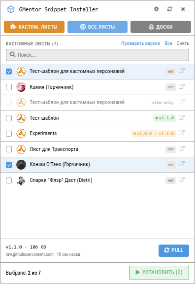
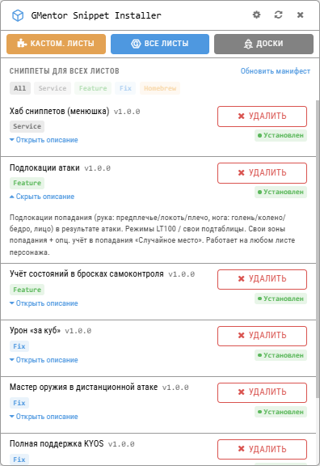
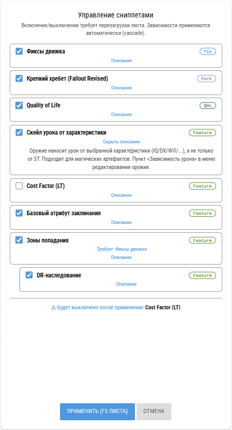
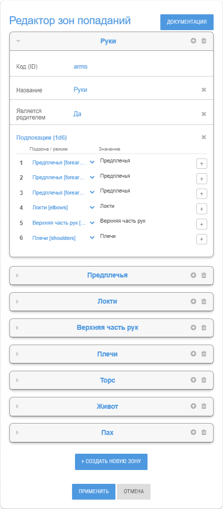
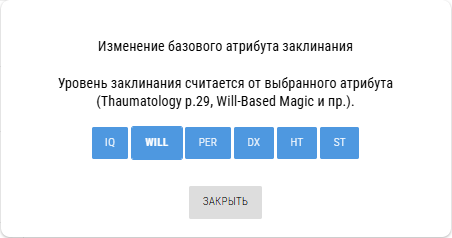
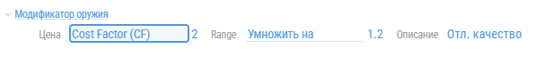
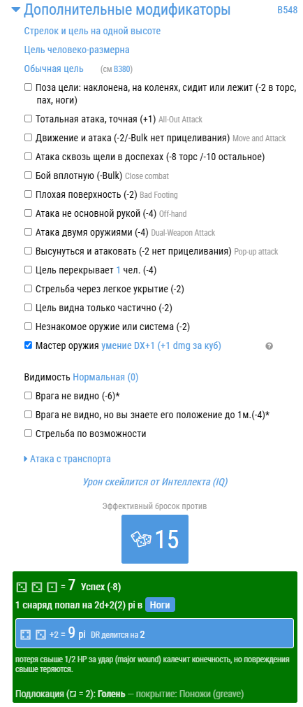

<p align="center">
  
</p>

<h1 align="center">GMentor Snippet Installer</h1>

<p align="center">
  <strong>Установка различных расширений и исправлений на <a href="https://gmentor.ru">gmentor.ru</a> в один клик.</strong>
</p>

<p align="center">
  <a href="LICENSE"></a>
  <a href="#установка"></a>
  <a href="./releases/Bundle/gmentor-bundle.js"></a>
  <a href="#установка"></a>
</p>

<p align="center">
  <a href="https://raw.githubusercontent.com/Syntiset/GMentor-Snippet-Installer/main/releases/Plugin/distributor.user.js"></a>
  <a href="./releases/Windows/GMentor-Snippet-Installer-portable.exe"></a>
  <a href="./releases/Windows/GMentor-Snippet-Installer-setup.exe"></a><br>
  <a href="./snippets/"></a>
  <a href="./releases/Linux/GMentor-Snippet-Installer.AppImage"></a>
  <a href="./releases/Linux/gmentor-snippet-installer_1.1.0_amd64.deb"></a>
  <a href="./releases/Linux/gmentor-snippet-installer-1.1.0.x86_64.rpm"></a>
</p>

<p align="center">
  <a href="#-что-включено">Что делает</a> · <a href="#-скриншоты">Скриншоты работы</a> · <a href="#-установка">Установка</a> · <a href="#%EF%B8%8F-откат-установки">Откат</a> · <a href="#-поддержка">Поддержка</a>
</p>

---

**У вас много кастомных листов в Менторе, и каждый раз обновлять скрипты и стили вручную на каждом — это множество кликов? Устали от нерешённых проблем в Менторе или хотите реализовать что-то новое на своём листе?**

GMentor Snippet Installer — это, в первую очередь, утилита, которая читает список ваших кастомных листов и одной кнопкой раздаёт свежий bundle (JS + LESS) на выбранные. Сохраняет ваш собственный код в `<gc-script>` через анкорные маркеры `GMENTOR-BUNDLE-{START,END}`. Доступна в виде Tampermonkey-плагина, standalone-приложения для Windows/Linux и набора отдельных сниппетов для ручного ввода.

<p align="center">
  <picture>
    <source media="(prefers-color-scheme: dark)" srcset="docs/img/GSI_1_dark.png">
    
  </picture>
  &nbsp;&nbsp;
  <picture>
    <source media="(prefers-color-scheme: dark)" srcset="docs/img/GSI_2_dark.png">
    
  </picture>
</p>
<p align="center"><sub>Тема на скриншотах подстраиваются под вашу тему GitHub.</sub></p>

---

## ✨ Что включено

Набор расширений для боя и листа персонажа — кастомные и более удобные **зоны попадания** с иерархией и наследованием DR, **списки подлокаций для зон попаданий**, **урон от выбранных характеристик**, перки, QoL и фиксы багов движка. Плюс — сниппеты для **любого листа** (не только кастомного) и для **мастерских досок**.

Раздаётся это всё при помощи единого **установщика GSI** (в виде браузерного плагина или приложения) с тремя вкладками:

<table>
  <tr align="center">
    <td width="33%" valign="top">
      <h3>🧩 Кастомные листы</h3>
      <p>Собранный bundle на ваши кастомные листы. Тоггл необходимых вам групп прямо на листе — кнопка «Сниппеты», с категориями и заранее проставленными зависимостями.</p>
    </td>
    <td width="33%" valign="top">
      <h3>📋 Все листы</h3>
      <p>Сниппеты для <em>любого</em> листа персонажа — фиксы и хоумбрю урона, состояний, цены и пр. Ставятся и запускается прямо в браузере.</p>
    </td>
    <td width="33%" valign="top">
      <h3>🎲 Доски</h3>
      <p>Инструменты для мастерских досок (например, новые режимы отображения персонажей или трекер инициативы). Ставятся в указанные вами доски.</p>
    </td>
  </tr>
</table>

> Полный список конкретных сниппетов (что каждый делает, зависимости, порядок) — читайте в [**`отдельном README`**](./snippets/README.md).


## 📸 Скриншоты

<details align="center"><summary><b>Меню «Сниппеты» на кастомном листе</b></summary>
<p></p>
<p><sub>Модалка управления сниппетами: чекбоксы групп, категории, описания</sub></p>
</details>

<details align="center"><summary><b>Редактор зон попаданий</b></summary>
<p></p>
<p><sub>Создавайте свои зоны попаданий, редактируйте основные. С подробной документацией!</sub></p>
</details>

<details align="center"><summary><b>Выбор базового атрибута заклинания</b></summary>
<p></p>
<p><sub>Выбор базового атрибута заклинания прямо на листе.</sub></p>
</details>

<details align="center"><summary><b>Cost Factor</b></summary>
<p></p>
<p><sub>CF в цене модификатора оружия</sub></p>
</details>

<details align="center"><summary><b>Три активных сниппета в одной модалке</b></summary>
<p></p>
<p><sub>Мастер оружия в дистанционной атаке, подлокации, урон от IQ.</sub></p>
</details>

## 📥 Установка

### Tampermonkey / Violentmonkey

#### 1. Установите userscript-менеджер

Подойдёт любой из двух — оба умеют запускать `.user.js`-плагины и автообновлять их:

- [**Tampermonkey**](https://github.com/Tampermonkey/tampermonkey) — самый популярный.
- [**Violentmonkey**](https://github.com/violentmonkey/violentmonkey) — open-source альтернатива.

*Не забудьте включить Developer Mode по просьбе менеджера! Без этого ни один userscript не работает.*

#### 2. Установите распространитель

**В один клик:** перейдите на [distributor.user.js](https://raw.githubusercontent.com/Syntiset/GMentor-Snippet-Installer/main/releases/Plugin/distributor.user.js). Менеджер автоматически предложит установить скрипт.

После установки менеджер проверяет обновления и подтягивает их сам.

#### 3. Откройте gmentor.ru

Залогиньтесь как обычно. В правом верхнем углу, рядом с кнопками `⚙` и `📚`, появится новая кнопка `📦`. Это и есть GMentor Snippet Installer.

#### 4. Поставьте сниппеты на нужные листы/доски

Кликните по `📦` → откроется popup с тремя вкладками:

- **Кастомные листы** — список ваших кастом-листов; отметьте чекбоксами и нажмите «Установить на N». Прогресс показывается inline на каждой строке.
- **Все листы** — сниппеты для любого листа персонажа (ставятся в браузер). Фильтр по категориям сверху.
- **Доски** — выберите доски и установите на них board-инструменты.

Никакого ручного ввода URL'ов — списки листов и досок подтягиваются из вашего профиля автоматически.

### Windows — Portable

1. Скачайте [`GMentor-Snippet-Installer-portable.exe`](./releases/Windows/GMentor-Snippet-Installer-portable.exe).
2. Запустить из любого места.

Windows Defender SmartScreen при первом запуске ругнётся (бинарь не подписан) — «Подробнее» → «Выполнить в любом случае». Требует WebView2 runtime (на Windows 10 1803+, на Windows 11 стоит из коробки).

### Windows — Installer (NSIS)

1. Скачайте [`GMentor-Snippet-Installer-setup.exe`](./releases/Windows/GMentor-Snippet-Installer-setup.exe).
2. Запустите. Откроется мастер установки.
3. Запуск из меню «Пуск» или через ярлык на рабочем столе.

### Linux — AppImage / .deb / .rpm

Три формата на выбор под ваш дистрибутив:

**AppImage** (любой дистрибутив, без установки):
```bash
chmod +x GMentor-Snippet-Installer.AppImage
./GMentor-Snippet-Installer.AppImage
```
Если ошибка про libfuse на Ubuntu 22.04+ — `sudo apt install libfuse2`.

**`.deb`**:
```bash
sudo apt install ./releases/Linux/gmentor-snippet-installer_1.1.0_amd64.deb
```

**`.rpm`**:
```bash
sudo dnf install ./releases/Linux/gmentor-snippet-installer-1.1.0.x86_64.rpm
```

Зависимости (`libwebkit2gtk-4.1`, `libgtk-3` и т.п.) подтянутся менеджером пакетов автоматически. Запуск через меню приложений или `gmentor-snippet-installer` в терминале.

### Источник bundle / сниппетов для standalone-приложения

По умолчанию приложение тянет всё с GitHub raw — последняя стабильная версия из этого репозитория:

```
На кастомные листы:   .../main/releases/Bundle/gmentor-bundle.{js,less}
На общие листы:       .../main/snippets/all/
Сниппеты для доски:   .../main/snippets/board/
```

URL'ы можно переопределить через настройки (шестерёнка вверху) — например, чтобы указать на форк, собственный CDN или локальный HTTP-сервер при разработке.

### Ручной копипаст сниппетов

Если нужны не все функции, или хочется поставить только часть на пару листов без приложения/плагина — копируйте отдельные сниппеты прямо в `CSS/LESS` и `SCRIPT` листа. Все исходники, порядок подключения, минимальный набор и инструкция — в [**`./snippets/README.md`**](./snippets/README.md).

## 📊 Проверка статуса

Напротив каждого листа после инициации появится бейдж. Вот обозначения:

- 🟢 `v1.1.0` — bundle актуальной версии, обновлять не нужно.
- 🟡 `v1.0.0 → v1.1.0` — установлена старая версия bundle, доступно обновление.
- ⚪ `нет` — bundle не установлен.
- 🔒 `view-only` — нет прав редактирования (листы только для просмотра), установка невозможна.

Кнопка **«Проверить версии»** в подзаголовке списка проходит по всем листам и узнаёт их актуальный статус. Если листов много — может занять достаточно времени.

## ↩️ Откат установки для кастомных листов

Открыть проблемный лист → `</>` в правом верхнем углу → вручную удалить блок между `{ // === GMENTOR-BUNDLE-START ===` и `} // === GMENTOR-BUNDLE-END ===`. Сохранить. F5.

Или: «Сниппеты» → снять все группы → Применить. Таким образом сниппеты остаются в коде, но не активируются.

## 🤝 Co-existence с вашим кодом

Если кастомный лист уже использует код в `SCRIPT` — GSI **не сотрёт ваш код**:

- При push'е GSI ищет блок между `{ // === GMENTOR-BUNDLE-START ===` и `} // === GMENTOR-BUNDLE-END ===`. Если блока нет (первый push на лист) — bundle **добавляется** в конец, ваш код сохраняется выше.
- При повторном push'е GSI находит маркеры и **заменяет только добавленный блок**, не трогая ваш код.
- При удалении bundle через ручное редактирование достаточно удалить блок между маркерами.

То же самое верно для `CSS/LESS` (маркеры `/* === GMENTOR-LESS-BUNDLE-START === */`...`/* === GMENTOR-LESS-BUNDLE-END === */`).

**Возможные конфликты:** bundle оборачивает/патчит функции движка `charCalcDR`, `damageRoll`, `modifyField`, `charCalcWeapons`, `getBestDefault`, `toolMeleeAttack`/`toolRangedAttack`, `getBasicSpellLevel`/`calcSpell`, `createMentorAce`. Общие сниппеты дополнительно трогают `toolSkillRoll`, `charCalcStats`, `getSw`, `getRandomLocation`, `toolLocationsTexts`. Если ваш код тоже их трогает — могут быть пересечения. Решение: через «Сниппеты» отключить группу, которая мешает (например `hit-locations` или `dr-inheritance`), а для общих сниппетов — снять галкой в настройках листа; затем делать точечные правки.

## 🛠 Редактирование XML-шаблона

На каждом кастомном листе Ментор показывает всего две кнопки в правой панели, раскрываемой через `</>`:
- `CSS/LESS` → редактор `<gc-style-less>` (стили)
- `SCRIPT` → редактор `<gc-script>` (JS-логика)

Эти кнопки и редакторы — встроенный функционал Ментора, обе доступны вне зависимости от установщика. GMentor Snippet Installer при работе с установкой bundle работает только с ними.

Но есть и малоизвестная, третья кнопка на Менторе - редактор XML-шаблона. Она доступна, к примеру, на [листе для транспорта](https://gmentor.ru/v3cd6bbb8a6a6b4abb9aa1930bb3cd39c). Очень хрупкая сама по себе функция, но даёт гибкость листа с нуля. При знании как работать - мастхэв, но нужно понимать, зачем оно вам вообще нужно. Для тех, кому обычного `CSS/LESS` и `SCRIPT` мало.
- `BASE XML` → редактор `<gc-basic-xml>` (структура листа: какие поля, какие списки)

## ❓ Поддержка

Если что-то сломалось:

1. В установщике: нажать `⚙` → «Очистить версии» / «Очистить Bundle».
2. В Tampermonkey dashboard: снять галку с скрипта → проверить что иконка пропала с сайта → вернуть обратно.
3. Если bundle сломал лист — вручную очистить всё в `</>` (см. «Откат установки»).
4. Не помогло? Добро пожаловать в [Issues](https://github.com/Syntiset/GMentor-Snippet-Installer/issues).

---
<p align="center">
  Лицензия MIT &copy; <a href="https://github.com/Syntiset">Syntiset</a>
</p>
